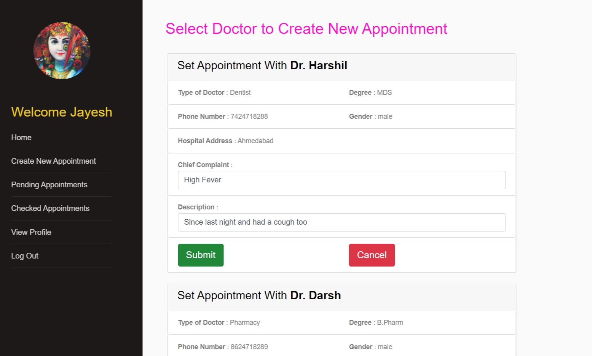
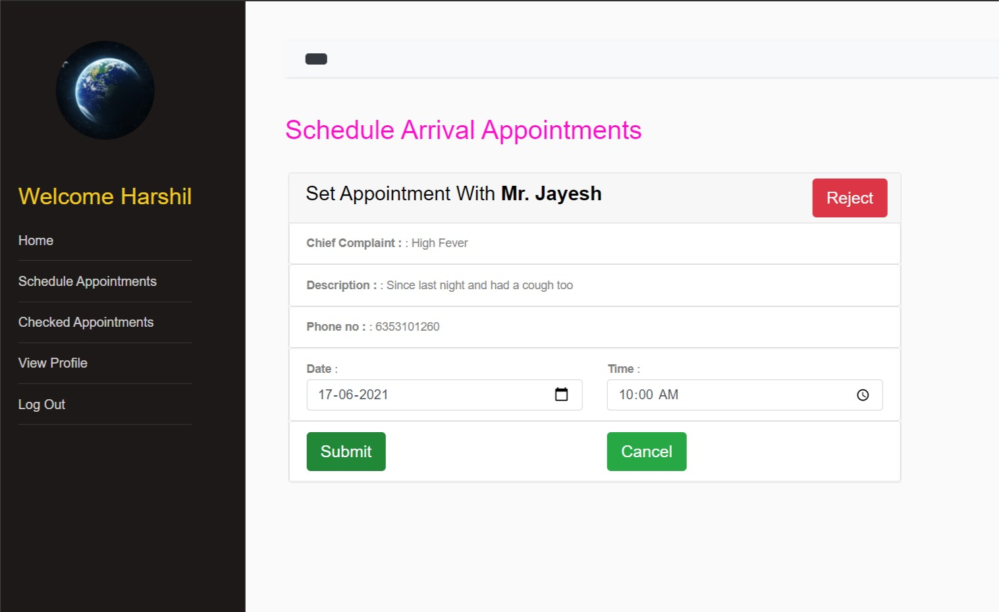
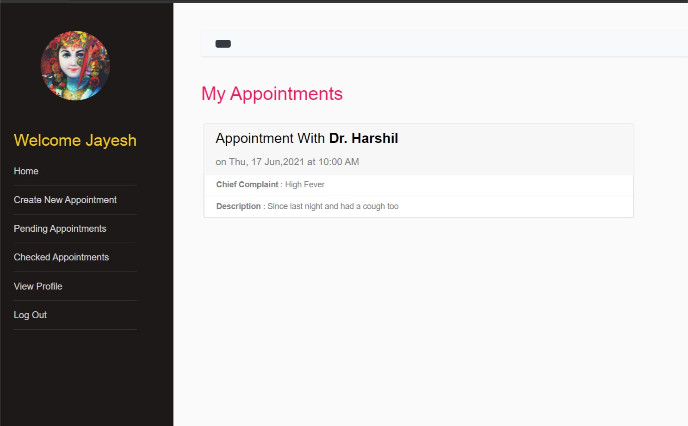
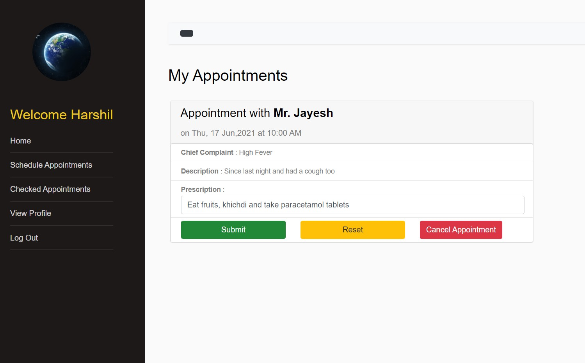
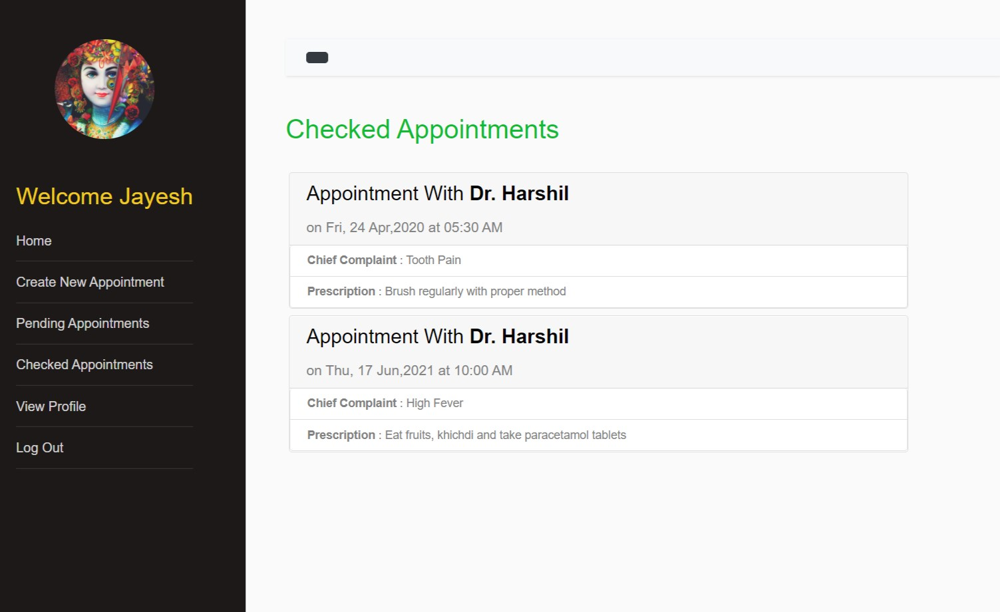

# **Hospital-Management-System**

## Pre-requisites
* [Python](https://www.python.org/)
* [Django Framework](https://docs.djangoproject.com/en/3.2/)
* [SQLite Database](https://www.sqlite.org/index.html)

## *Story of this System*
* In this system, there are 2 types of users viz. **Patient** and **Doctor**.
* **Patient** will create appointment with the **Doctor** by providing chief-complaint and description. 
* Now, **Doctor** can either schedule or cancel the **Patient**'s appointment. 
* If the appointment is scheduled, then **Patient** is required to visit that **Doctor**'s hospital on that scheduled date and time.
* **Patient** visits the hospital and **Doctor** will check for the patient and will write the prescription.

## Screenshots
* Here, Jayesh is **Patient** user and Harshil is **Doctor** user

<p align="center"></img></p>
<p align="center"></img></p>
<p align="center"></img></p>
<p align="center"></img></p>
<p align="center"></img></p>
<p align="center"></img></p>

## How to run this project
1. Install the above pre-requisites on your machine
2. Place the source code inside your project directory
3. Run the following migration commands:-
```
    python manage.py makemigrations
    python manage.py migrate
```
4. Now, run server:
```
    python manage.py runserver
```
5. Then, go to the link to run the application locally in your browser.